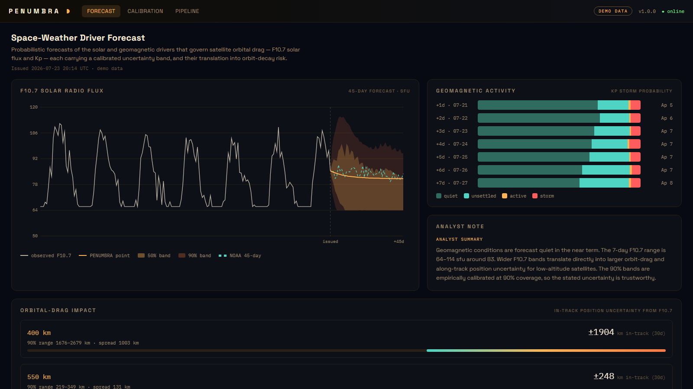

# PENUMBRA

[](LICENSE)
[](backend/requirements.txt)

**Probabilistic Space-Weather Driver Forecasting** — an open-source pipeline that forecasts
the two solar/geomagnetic drivers that govern satellite orbital drag (**F10.7** solar radio flux
and **Kp** geomagnetic activity), attaches **calibrated uncertainty bands** to every prediction,
and translates that uncertainty into orbital-drag and orbit-decay risk.

> Named for the *penumbra* — the fuzzy partial shadow of a sunspot, and the band of uncertainty
> that surrounds every honest forecast. Making that band visible is the whole point.

**🌗 Live demo: [http://13.127.244.0:8080](http://13.127.244.0:8080)** — F10.7 fan chart, Kp storm
probabilities, orbital-drag impact, and the calibration report
([API docs](http://13.127.244.0:8080/docs) · [live pipeline](http://13.127.244.0:8080/pipeline)).


*The F10.7 forecast with nested 50%/90% uncertainty bands and NOAA's forecast overlaid; per-day Kp
storm probabilities; and the headline — how the F10.7 uncertainty becomes hundreds-to-thousands of
km of in-track position uncertainty for low-altitude satellites.*

## Why this exists

Atmospheric drag is the single largest source of orbit-prediction error in low Earth orbit, and
the bottleneck is usually not the density model — it's the **forecast of the space-weather drivers**
feeding it. Yet the official operational forecasts (including NOAA's 45-day F10.7/Ap product) are
**single point values with no uncertainty attached**, leaving satellite operators to guess how much
to trust them (Parker et al., 2024, *AGU Space Weather*). Probabilistic methods exist in the
research literature but there is **no operational product**. PENUMBRA is that missing product.

It is the phase-2 companion to [KESSLER](https://github.com/siddhashutosh/kessler): KESSLER asks
*"is something about to hit my satellite?"*; PENUMBRA asks *"how much should I trust the predicted
positions that answer depends on?"* Together they form an **open orbital-risk stack**.

## What it does

- **F10.7 forecast** — a point forecast (persistence + mean-reversion) with **empirical
  quantile bands by lead time**, derived from a walk-forward backtest of forecast errors, out to 45 days.
- **Kp / geomagnetic forecast** — per-lead-day **storm-category probabilities**
  (quiet / unsettled / active / storm) instead of a misleading point value on a bounded index.
- **Drag-impact translation** — maps the F10.7 uncertainty band to thermospheric density and
  orbit-decay uncertainty at reference altitudes: the bridge to conjunction assessment.
- **Calibration audit** — the credibility artifact: reliability/coverage (does the 90% band contain
  truth 90% of the time?), pinball loss, and skill score **against NOAA's own 45-day forecast**.

## Use the math without the app

The forecasting core ships as a standalone package (no FastAPI, no UI):

```bash
pip install penumbra-toolkit   # F10.7/Kp forecasts · calibration backtest · drag translation
```

```python
from penumbra_toolkit import DailySeries, walk_forward_errors, forecast, coverage
bt = walk_forward_errors(history, lead_days=45, min_train=400)   # leakage-free
fc = forecast(history, 45, bt.error_quantiles)                   # calibrated bands
print(fc.point[6], fc.bands[5][6], fc.bands[95][6], coverage(bt)[0])
```

See [`packages/penumbra-toolkit/`](packages/penumbra-toolkit/) — generated from
`backend/app/logic/` (the source of truth) and kept in sync via `packages/sync.py`.

## Data sources & attribution

- **NOAA SWPC** (`services.swpc.noaa.gov`) — F10.7, planetary Kp, and the official 45-day forecast.
  US Government work, public domain.
- **GFZ Potsdam** — historical Kp index archive.

Runs fully in **Demo Mode** with bundled historical data (zero credentials, offline). Live mode
pulls the public NOAA feeds directly — no API key required, cache-first by architecture.

## Status

🚧 Under active construction. See [`documents/`](documents/) for the SRS/HLD/LLD design set.

## License

Apache-2.0 — see [LICENSE](LICENSE). Space-weather data courtesy of NOAA SWPC and GFZ Potsdam.
